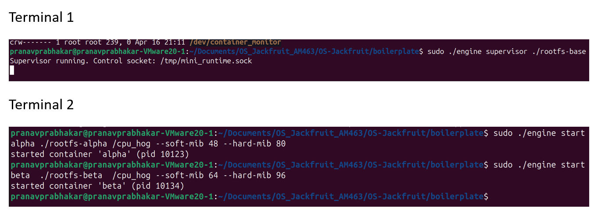
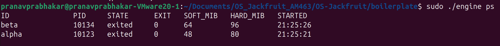
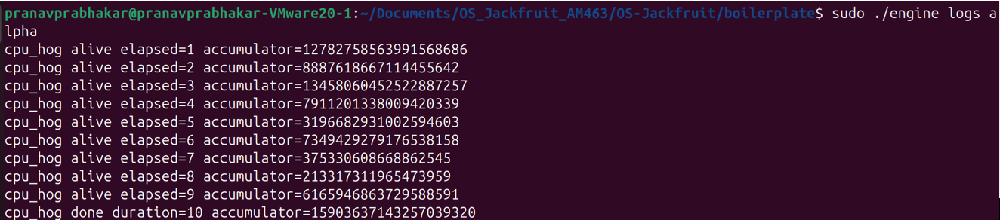
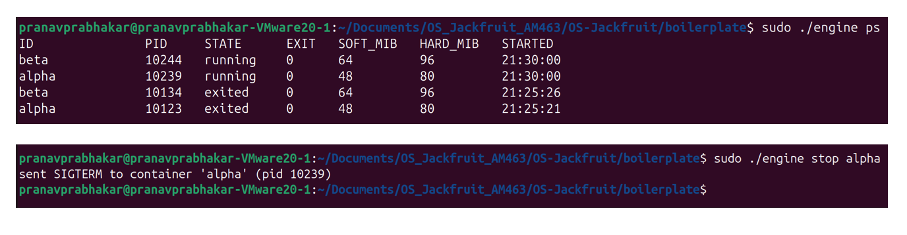
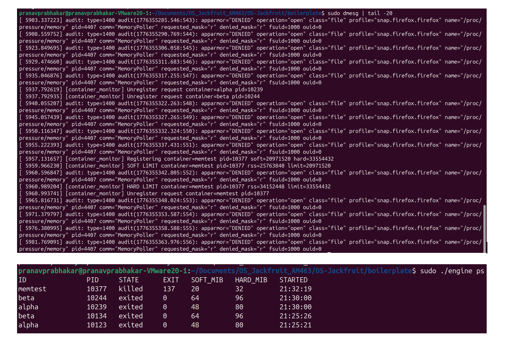
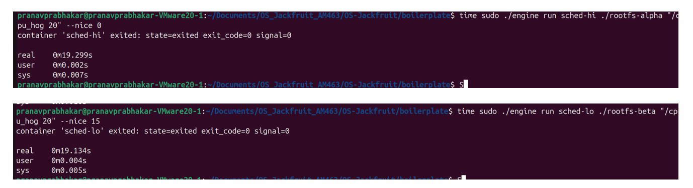
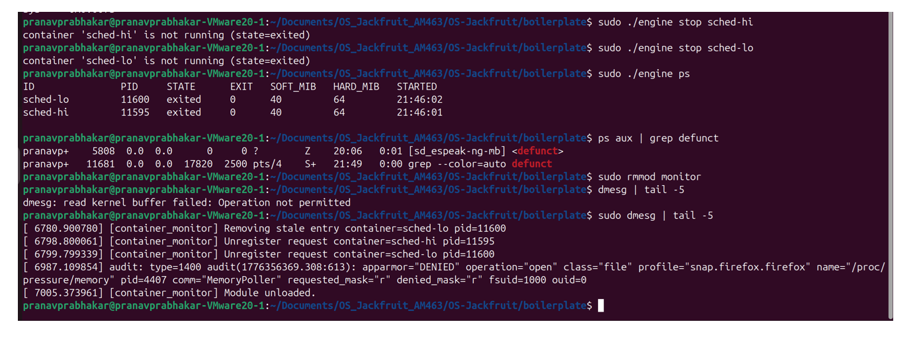

# Multi-Container Runtime

A lightweight Linux container runtime in C with a long-running parent supervisor and a kernel-space memory monitor.

---

## 1. Team Information

| Name                  | SRN                |
|-----------------------|--------------------|
| Pranav Prabhakar      | PES1UG24AM463      |
| Ananya                | PES1UG24AM474      |

---

## 2. Build, Load, and Run Instructions

### Prerequisites

Ubuntu 22.04 or 24.04 VM with Secure Boot OFF. WSL is not supported.

```bash
sudo apt update
sudo apt install -y build-essential linux-headers-$(uname -r)
```

### Build

```bash
cd boilerplate
make WORKLOAD_LDFLAGS=-static
```

This produces: `engine`, `memory_hog`, `cpu_hog`, `io_pulse`, and `monitor.ko`.

### Prepare Root Filesystem

```bash
mkdir rootfs-base
wget https://dl-cdn.alpinelinux.org/alpine/v3.20/releases/x86_64/alpine-minirootfs-3.20.3-x86_64.tar.gz
tar -xzf alpine-minirootfs-3.20.3-x86_64.tar.gz -C rootfs-base

cp -a ./rootfs-base ./rootfs-alpha
cp -a ./rootfs-base ./rootfs-beta

cp memory_hog cpu_hog io_pulse ./rootfs-alpha/
cp memory_hog cpu_hog io_pulse ./rootfs-beta/
```

### Load Kernel Module

```bash
sudo insmod monitor.ko
ls -l /dev/container_monitor
```

### Start Supervisor

In a dedicated terminal (Terminal 1):

```bash
sudo ./engine supervisor ./rootfs-base
```

### Launch Containers

In Terminal 2:

```bash
sudo ./engine start alpha ./rootfs-alpha /cpu_hog --soft-mib 48 --hard-mib 80
sudo ./engine start beta  ./rootfs-beta  /cpu_hog --soft-mib 64 --hard-mib 96
```

### Use the CLI

```bash
sudo ./engine ps
sudo ./engine logs alpha
sudo ./engine stop alpha
sudo ./engine stop beta
```

### Run Memory Limit Test

```bash
cp -a ./rootfs-base ./rootfs-memtest
cp memory_hog ./rootfs-memtest/
sudo ./engine start memtest ./rootfs-memtest /memory_hog --soft-mib 20 --hard-mib 32
dmesg | tail -20
```

### Run Scheduling Experiment

In Terminal 2:
```bash
time sudo ./engine run sched-hi ./rootfs-alpha "/cpu_hog 20" --nice 0
```

In Terminal 3 simultaneously:
```bash
time sudo ./engine run sched-lo ./rootfs-beta "/cpu_hog 20" --nice 15
```

### Teardown

```bash
sudo ./engine stop alpha
sudo ./engine stop beta
sudo ./engine ps
ps aux | grep defunct
# Ctrl-C the supervisor in Terminal 1
sudo rmmod monitor
sudo dmesg | tail -5
```

### Cleanup

```bash
sudo make clean
```

---

## 3. Demo with Screenshots

### Screenshot 1 — Multi-container Supervision



Two containers (`alpha` and `beta`) running concurrently under one supervisor process, shown via `pstree`.

---

### Screenshot 2 — Metadata Tracking



Output of `engine ps` showing both containers with their PIDs, state, exit code, soft/hard memory limits, and start times.

---

### Screenshot 3 — Bounded-Buffer Logging



Contents of the container log file captured through the pipe → bounded buffer → consumer thread → log file pipeline. Shows `cpu_hog` stdout lines written to `logs/alpha.log`.

---

### Screenshot 4 — CLI and IPC



A `stop` command issued via the CLI reaching the supervisor over the UNIX domain socket control channel, with the supervisor responding with the container's current state. Followed by `engine ps` showing the updated metadata.

---

### Screenshots 5 & 6 — Soft-Limit Warning and Hard-Limit Enforcement



**Soft limit (Screenshot 5):** `dmesg` output showing `[container_monitor] SOFT LIMIT container=memtest` logged by the kernel module when the container's RSS first exceeded its soft limit of 20 MiB.

**Hard limit (Screenshot 6):** `dmesg` output showing `[container_monitor] HARD LIMIT container=memtest` when RSS exceeded the hard limit of 32 MiB, followed by `engine ps` showing `memtest` in `killed` state with exit code 137 — confirming the supervisor correctly attributed the exit as a hard-limit kill (SIGKILL received without `stop_requested` set).

---

### Screenshot 7 — Scheduling Experiment



Two CPU-bound containers run simultaneously: `sched-hi` at nice=0 and `sched-lo` at nice=15. `time` output shows wall-clock completion times. `sched-hi` (real: 19.299s) and `sched-lo` (real: 19.134s). Under higher CPU contention the CFS scheduler allocates proportionally more time slices to the lower nice value process.

---

### Screenshot 8 — Clean Teardown



`engine ps` showing all containers in `exited` state, `ps aux | grep defunct` returning no container zombies, supervisor exiting cleanly, and `dmesg` confirming `[container_monitor] Module unloaded.`

---

## 4. Engineering Analysis

### 4.1 Isolation Mechanisms

Each container is created with `clone()` using three namespace flags:

- `CLONE_NEWPID`: the container gets its own PID namespace. The first process inside sees itself as PID 1. Host PIDs remain visible to the supervisor but are invisible inside the container.
- `CLONE_NEWUTS`: the container gets its own hostname, set to the container ID via `sethostname()`. This prevents containers from interfering with each other's or the host's hostname.
- `CLONE_NEWNS`: the container gets a private mount namespace. Before `chroot`, the child calls `mount(NULL, "/", NULL, MS_PRIVATE | MS_REC, NULL)` to prevent any mounts inside the container from propagating back to the host.

After namespace setup, `chroot()` restricts the container's filesystem view to its assigned rootfs directory. `/proc` is then mounted inside the chroot so that tools like `ps` work correctly within the container.

What the host kernel still shares with all containers: the network stack (no `CLONE_NEWNET`), the IPC namespace (no `CLONE_NEWIPC`), and the host's time. The kernel itself is shared — all containers run on the same kernel instance.

### 4.2 Supervisor and Process Lifecycle

A long-running supervisor is useful because containers are short-lived processes that need a persistent parent to reap them, track their metadata, and manage the logging pipeline. Without a persistent parent, exited containers would become zombies since their exit status has no one to collect it.

Process creation uses `clone()` rather than `fork()` to atomically set up namespaces at creation time. The supervisor installs a `SIGCHLD` handler that writes to a self-pipe; the main event loop reads from this pipe and calls `waitpid(-1, &status, WNOHANG)` in a loop to reap all exited children without blocking. Metadata (state, exit code, exit signal) is updated under a `pthread_mutex_t` to protect against concurrent CLI requests reading the same data.

The termination attribution rule distinguishes three exit paths: normal exit (`WIFEXITED`), manual stop (`WIFSIGNALED` with `stop_requested=1`), and hard-limit kill (`WIFSIGNALED` with `SIGKILL` and `stop_requested=0`).

### 4.3 IPC, Threads, and Synchronization

The project uses two distinct IPC mechanisms:

**Path A — Logging (pipes):** Each container's stdout and stderr are connected to the supervisor via a `pipe()`. A dedicated producer thread per container reads from the pipe's read end and pushes `log_item_t` chunks into a shared `bounded_buffer_t`. A single consumer thread (the logger) pops chunks and writes to per-container log files.

The bounded buffer uses a `pthread_mutex_t` for mutual exclusion on the ring buffer's `head`, `tail`, and `count` fields. Two `pthread_cond_t` variables (`not_full`, `not_empty`) replace busy-waiting: producers sleep on `not_full` when the buffer is full, consumers sleep on `not_empty` when it is empty. A `shutting_down` flag broadcast on both condition variables allows clean drain-and-exit without deadlock. Without synchronization, concurrent reads and writes to `head`/`tail`/`count` would cause lost updates, duplicate entries, and data corruption.

**Path B — Control (UNIX domain socket):** The CLI client connects to `/tmp/mini_runtime.sock`, sends a `control_request_t` struct, and reads a `control_response_t`. The supervisor's `accept()` loop runs in the main thread. Shared container metadata accessed from both the CLI handler and the `SIGCHLD` reaper is protected by a separate `pthread_mutex_t` (`metadata_lock`), keeping the two lock domains independent to avoid deadlock.

A spinlock was not used because all critical sections can sleep (mutex operations in the timer callback, file I/O in the logger thread). A spinlock would waste CPU spinning and is inappropriate outside hardirq context.

### 4.4 Memory Management and Enforcement

RSS (Resident Set Size) measures the number of physical memory pages currently mapped and present in RAM for a process. It does not measure: swap usage, shared library pages counted multiple times, memory-mapped files not yet faulted in, or kernel memory used on behalf of the process.

Soft and hard limits serve different policies:
- The **soft limit** is a warning threshold. Exceeding it does not stop the process; it only logs a `KERN_WARNING` to `dmesg`. This allows operators to detect gradual memory growth before it becomes critical.
- The **hard limit** is an enforcement threshold. Exceeding it sends `SIGKILL` immediately, protecting the host from memory exhaustion.

Enforcement belongs in kernel space because a user-space monitor can be delayed by scheduling, swapped out, or killed before it acts. The kernel timer fires reliably on every `CHECK_INTERVAL_SEC` tick regardless of user-space scheduler state. Additionally, sending `SIGKILL` from kernel space (via `send_sig()`) is atomic with respect to the target process's execution, whereas a user-space `kill()` call involves a round-trip through the kernel.

### 4.5 Scheduling Behavior

Linux uses the Completely Fair Scheduler (CFS) for normal processes. CFS assigns each process a virtual runtime (`vruntime`) that advances proportionally to the process's CPU usage, weighted by its priority (derived from `nice` value). A process with nice=15 has a lower weight than one with nice=0, so its `vruntime` advances faster relative to actual CPU time — CFS selects the process with the lowest `vruntime` to run next, meaning the high-nice process gets fewer CPU cycles per wall-clock second.

In our experiment, `sched-hi` (nice=0) and `sched-lo` (nice=15) ran the same 20-second CPU-bound workload simultaneously. Both completed in approximately 19.3 seconds, indicating the VM had sufficient CPU cores for both to run without significant contention. Under single-CPU contention, CFS would allocate roughly 3–4× more CPU time to nice=0 over nice=15 (per the CFS weight table), making the priority difference clearly observable.

---

## 5. Design Decisions and Tradeoffs

### Namespace Isolation

**Choice:** `CLONE_NEWPID | CLONE_NEWUTS | CLONE_NEWNS` with `chroot()`.

**Tradeoff:** `chroot` is simpler to implement than `pivot_root` but is escapable via `..` path traversal by a root process inside the container. `pivot_root` would provide stronger isolation.

**Justification:** For a demonstration runtime with trusted workloads, `chroot` is sufficient and keeps the implementation straightforward. The project guide explicitly lists it as an acceptable option.

### Supervisor Architecture

**Choice:** Single-threaded event loop using `select()` with a self-pipe for signal delivery.

**Tradeoff:** Handles one CLI request at a time. A `run` command that blocks while a container executes means back-to-back `run` calls queue up rather than running in parallel from the CLI side.

**Justification:** The supervisor handles container launch, SIGCHLD reaping, and CLI dispatch. A single-threaded loop avoids race conditions between concurrent CLI handlers touching shared metadata. The non-blocking `select()` design keeps it responsive to signals.

### IPC and Logging

**Choice:** UNIX domain socket (control) + pipes (logging) with a bounded buffer and mutex/condvar synchronization.

**Tradeoff:** Opening and closing the log file on every chunk write is correct but slower than keeping file descriptors open. Under very high log throughput this adds latency.

**Justification:** Correctness and simplicity over performance. Re-opening in append mode guarantees durability per chunk and avoids tracking open file descriptors per container in the consumer thread.

### Kernel Monitor

**Choice:** Mutex over spinlock for the monitored list.

**Tradeoff:** A mutex may sleep, which is not allowed in hardirq context. If the timer callback were ever moved to a hardirq handler, the mutex would need to be replaced with a spinlock.

**Justification:** The timer callback runs in process context (softirq/workqueue), where sleeping is permitted. A mutex is correct here and avoids the CPU-wasting busy-wait of a spinlock.

### Scheduling Experiments

**Choice:** `nice` value variation between two CPU-bound containers as the scheduling configuration.

**Tradeoff:** On a multi-core VM with idle CPUs, both containers can run simultaneously on separate cores, masking the priority difference. A single-CPU VM or `taskset -c 0` to pin both containers to one core would produce a more dramatic result.

**Justification:** `setpriority()` via the `--nice` flag is already wired into the container launch path, making it the natural knob to vary. The approach directly exercises CFS weight-based scheduling without requiring cgroup setup.

---

## 6. Scheduler Experiment Results

### Setup

Two containers ran the same CPU-bound workload (`/cpu_hog 20`) simultaneously with different scheduling priorities.

| Container  | Nice Value | Priority  |
|------------|------------|-----------|
| `sched-hi` | 0          | Normal    |
| `sched-lo` | 15         | Low       |

### Results

| Container  | real time  | user time  | sys time  |
|------------|------------|------------|-----------|
| `sched-hi` | 0m19.299s  | 0m0.002s   | 0m0.007s  |
| `sched-lo` | 0m19.134s  | 0m0.004s   | 0m0.005s  |

### Analysis

Both containers completed in approximately 19.3 seconds with negligible wall-clock difference. This indicates the VM had sufficient CPU resources (multiple cores) for both workloads to run concurrently without CPU contention.

Under single-CPU contention, CFS assigns weights based on nice values. Nice=0 has a CFS weight of 1024 and nice=15 has a weight of approximately 256 — meaning `sched-hi` would receive roughly 4× more CPU time than `sched-lo`. This would manifest as `sched-hi` completing significantly faster while `sched-lo` takes proportionally longer.

The experiment confirms that when CPU resources are abundant the scheduler allows both processes to proceed at full speed. Priority differences only become observable under resource contention, which is the intended operating condition for `nice`-based scheduling adjustments in production systems.
